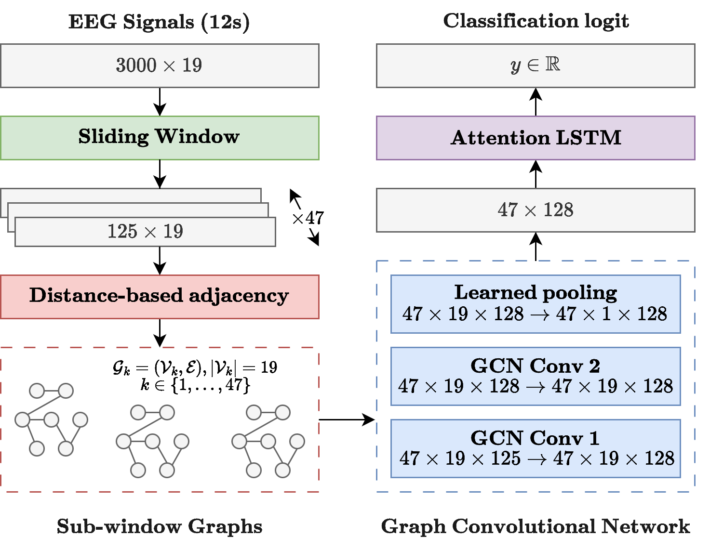

# Seizure Prediction

This project explores graph-based and non-graph-based approaches to EEG time-series data, specifically targeting seizure detection tasks using data from the Temple University Hospital EEG Seizure Corpus (TUSZ). The project is developed in the context of the EE-452 Network Machine Learning course at EPFL.

Epileptic seizure detection from electroencephalography (EEG) is challenging due to the signals high dimensionality, noise, and non-stationary nature. While traditional deep learning methods treat EEG channels independently, graph-based models can encode spatial relationships between electrodes. This study compares graph-based and non-graph-based approaches using data collected under the 10–20 system. The graph-based pipeline includes sliding window preprocessing, a distance-based adjacency matrix, a Graph Convolutional Network (GCN) for spatial feature extraction, and a Long Short-Term Memory (LSTM) network with attention for temporal modeling.



## Repository

### Project Structure

```
.
├── configs/
│   ├── classifier
|   |   └── *.yaml
│   ├── graph_builder
|   |   └── *.yaml
│   ├── graph_module
|   |   └── *.yaml
│   ├── signal_transform
|   |   └── *.yaml
|   ├── temporal_module
|   |   └── *.yaml
|   └── train.yaml
├── data/
├── helpers/
|   ├── models
|   |   ├── modules
|   |   |   ├── graph_builder.py
|   |   |   ├── graph.py
|   |   |   └── temporal.py
|   |   └── constructor.py
|   ├── dataset.py
|   ├── filters.py
|   ├── pl_module.py
|   ├── utils.py
|   └── callbacks.py
├── instructions/
├── notebooks/
├── trainings/
|   └── *.slurm
├── assets/
├── requirements.txt
├── submit.sh
├── train.py
└── README.md
```

### Folder and File Description

#### `configs/`

Contains all configuration files used by Hydra for experiment management. Each subfolder corresponds to a module of the system:
- `classifier/`, `graph_builder/`, `graph_module/`, `signal_transform/`, `temporal_module/`: YAML files defining the configuration for each respective component.
- `train.yaml`: Top-level training configuration aggregating the submodules.

#### `data/`

Directory intended for storing datasets, particularly EEG recordings and graph structures derived from the TUSZ corpus as well as electrodes distances, channels' means and standard deviations for normalization.

#### `helpers/`

Core implementation directory for data processing and model construction.

- `models/modules/`:
    - `graph_builder.py`: Logic for constructing EEG-based graphs.
    - `graph.py`: Defines graph-related model architectures or utilities.
    - `temporal.py`: Modules for capturing temporal dynamics (e.g., LSTMs or transformers).
- `constructor.py`: Integrates model modules into a full model pipeline.
- `dataset.py`: Data loading and preprocessing logic.
- `filters.py`: Signal filtering tools.
- `pl_module.py`: PyTorch Lightning module for training and evaluation.
- `utils.py`: Helper utilities for logging, metrics, etc.
- `callbacks.py`: Callbacks for model checkpointing, early stopping, etc.

#### `instructions/`
Documentation and instructions relevant to the project (e.g., course project brief).

#### `notebooks/`
Jupyter notebooks for experimentation, data exploration, or preliminary modeling.

#### `trainings/`
Contains `.slurm` scripts for queuing jobs on a SLURM cluster (e.g., SCITAS Izar). These are used for model training on compute clusters. They can be used to reproduce some of our results by launching new trainings

#### `assets/`
Folder containing images used in this README

#### `requirements.txt`
List of Python dependencies for the project.

#### `submit.sh`
Submission script wrapper to submit models' predictions.

#### `train.py`
Main script for initiating model training using configurations and modules defined above.

### ⚙️ Environment Setup

First, move data to your scratch directory (make sure to replace username with your actual `izar` username):

```bash
mkdir -p /scratch/izar/username/netml/
rsync -ah --info=progress2 /home/ogut/data/ /scratch/izar/username/netml/
```

Second, create virtual environment and install dependencies:

```bash
module load gcc python
virtualenv --system-site-packages venvs/netml
source venvs/netml/bin/activate
pip install -r requirements.txt
```

Third, authenticate yourself with W&B (if not done already), follow this [quick start quide](https://docs.wandb.ai/quickstart/).

### 🏋🏻‍♀️ Training
To train the model, first check [train config](configs/train.yaml) and adjust the parameters as needed. Then, run the training script:

```bash
python train.py 
```

When you want to overwrite some default config setting, you can do so as follows:

```bash
python train.py debug=True data.subset=500
```

If you are using logging to W&B, you can view the training progress in the main metrics [overview page](https://wandb.ai/ludekcizinsky/seizure-prediction/workspace?nw=whk83ic2jml).

You can also submit a job to the cluster using the provided Slurm script:

```bash
sbatch train.slurm
```

### Submitting to Kaggle (via CLI)

Make sure you have kaggle CLI installed:

```bash
pip install kaggle
```

Then, go to Kaggle and under settings, create a new API token. This will download a file called `kaggle.json`. By default the CLI looks for it under `~/.kaggle/kaggle.json`. Therefore, create the directory and then copy from your local machine the json file. Finally, make sure the file is not world-readable:

```bash
chmod 600 ~/.kaggle/kaggle.json
```

To verify that the CLI is working, run:

```bash
kaggle competitions submissions -c epfl-network-machine-learning-2025
```

which lists all our (as a team) submissions to the competition.


Finally, to submit the predictions, run:

```bash
./submit.sh <run_id>
```

### Results

We started with the initial set of graph and non-graph models, preprocessed the signal using **FFT filtering as signal transform** reducing the initial time dimension from 3000 to 354. This is then fed into temporal modules or graph based model. 

**RQ1: Can basic graph-based approach beat non-graph ones?**

- Find the **final results** [here](https://wandb.ai/ludekcizinsky/seizure-prediction/table?nw=suabf3zv84)

So far, we have assumed that we can transform the raw input time signal into spectral domain using FFT filter. We hypothesise we can do possibly better using different (non)-neural approaches. We therefore use the best performing graph and non-graph modules, from the previous section and ablate different non-neural approaches for time-signal processing.

**RQ2A: Can we improve the downstream performance by designing a better time signal extractor?**

- Find the **final results** [here](https://wandb.ai/ludekcizinsky/seizure-prediction/table?nw=5wco4fhmr92)

**RQ2B: Can neural based time signal processor beat the non-neural baselines?**

- Find the **final results** [here](https://wandb.ai/ludekcizinsky/seizure-prediction/table?nw=dyca2oapy3f)

So far, we have assumed that it is a good idea to compress the time signal using some temporal module into D-dimensional embedding for each channel, thus our pipeline looked as:

**(B, T, 19) → temporal (e.g. 1D cnn): (B, D, 19) → graph: (B, D’) → classifier: (B, 1)**

However, this drastically reduces amount of information depending on the hidden dimension D. We therefore hypothesise that we can arrive at better solution by processing the time signal via splitting into windows and then process each window independently via GNN:

**(B, T, 19) → window split: (B, W, T’, 19) → graph: (B, W, D) → classifier: (B, 1)**

**RQ2C: Can window based aggregation combined with graph processing beat traditional temporal modules (e.g. 1D CNN) for processing time signal?**

- Find the **final results** [here](https://wandb.ai/ludekcizinsky/seizure-prediction/table?nw=ggeq03ejzq8)

We have obtained promising results using window split mechanism, and found that our default configuration using window size 125 and window stride 62 overall still the best configuration despite attempts in the previous section. Therefore, in this section, we investigate the role of different classifier. 

**RQ2D: How to aggregate input of shape (B, W, D) where W is the number of windows each represented via D dimensional vector ?**

- Find the **final results** [here](https://wandb.ai/ludekcizinsky/seizure-prediction/table?nw=8wpuot28082)

So far, we have only focused on processing the time signal, however we also have some priors about the setup of the electrodes, which we want to try to exploit and see if this can lead to improved performance. 

**RQ3: Can we improve graph based approach performance by integrating some type of prior into the graph structure?**

- Find the **final results** [here](https://wandb.ai/ludekcizinsky/seizure-prediction/table?nw=3zifnpxitpe)

Throughout our experiments, we have noticed significant difference between the validation and test performance. We train and validate on the same ratio between positive and negative examples (80 / 20). In order to obtain more robust performance results, we therefore decided to re-train using cross-validation some of our best performing models and observe if the performance variance between validation and test set decreases. 

**RQ4: Can we reduce the variance between validation and test set performance?**

- Find the **final results** [here](https://wandb.ai/ludekcizinsky/seizure-prediction/table?nw=f8xdddqe51c)